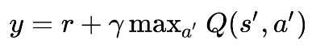

# Article link: https://arxiv.org/pdf/1802.09477.pdf

# Problems
## Overestimation bias

In discrete Q Learning is updated with taking max over actions:

This maximization causes overestimation of Q and this overestimation is easily propagated.
The same situation can arise with Actor-Critic model, namely, Deterministic Policy Gradients. The policy update causes value overestimation. This was theoretically proven in the article and confirmed with the experiments.

## Variance

High variance estimates add noise to gradient updates of the policy. It makes the convergence slower.
Moreover, as estimates of value function use estimates of subsequent state, the error propagates.

# Solutions

## Overestimation bias
