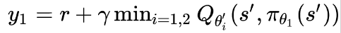
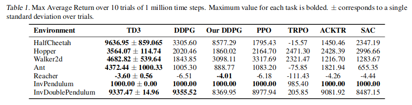
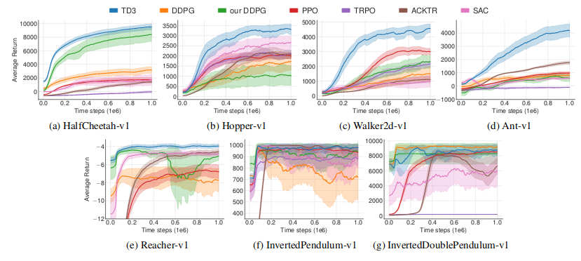

# Article link: https://arxiv.org/pdf/1802.09477.pdf

# Problems
## Overestimation bias

In discrete Q Learning is updated with taking max over actions:

This maximization causes overestimation of Q and this overestimation is easily propagated.
The same situation can arise with Actor-Critic model, namely, Deterministic Policy Gradients. The policy update causes value overestimation. This was theoretically proven in the article and confirmed with the experiments.

## Variance

High variance estimates add noise to gradient updates of the policy. It makes the convergence slower.
Moreover, as estimates of value function use estimates of subsequent state, the error propagates.

# Solutions

## Overestimation bias

Add additional critic and update the target using min of two critic Q values:

It not only promises to solve overestimation problem, but will make the model choose the state with smaller variance, and it is good for stable learning. Underestimation can appear as well, but it is not propagated via updates, so is much safer.

## Variance

1. Update the policy only when critic has converged. Namely, wait for d iterations before policy update. Even after that update policy slowly.
2. Add some normal noise to target policy -- smoothing regularization. Intuitively it will make the model prefer actions with stable value.

# Experiments

The ideas above are embedded into DPPG and are called TD3 (Twin Delayed Deep Deterministic policy gradient algorithm). The algorithm is tested on MuJoCo suite and outperforms SoTA policy gradient algorithms:

